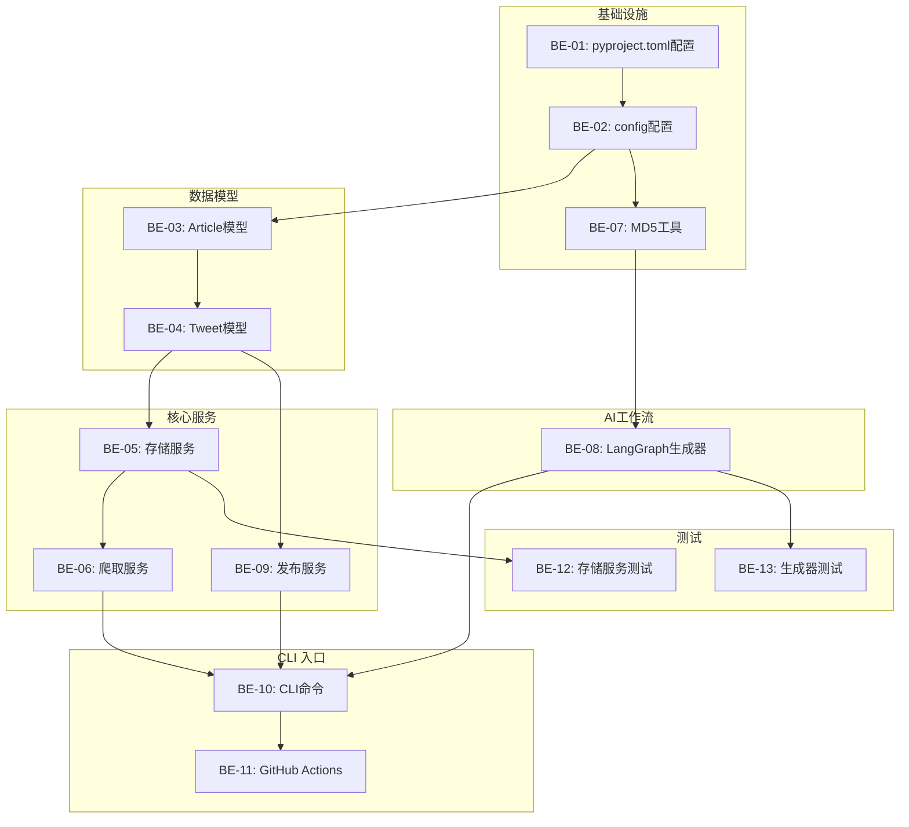

# 实施计划：BinanceSquareBot 全量后端开发

> 本计划由 fullstack-dev-workflow skill 生成，开发代码前必须先生成并确认计划
> ⚠️ **计划包含所有开发任务及对应设计文档链接，确保完整追溯**

---

## 一、计划基础信息

| 属性 | 内容 |
|------|------|
| 计划ID | PLAN-BE-binance-square-bot-20260414-001 |
| 计划名称 | BinanceSquareBot 全量后端开发 |
| 关联需求ID | REQ-BOT-001 ∼ REQ-BOT-007 |
| 执行范围 | 后端（纯Python CLI + AI应用） |
| 计划状态 | pending |
| 创建时间 | 2026-04-14 22:26:00 |
| 开始时间 | - |
| 完成时间 | - |
| 预计工时 | 3小时 |
| 实际工时 | - |

### 计划ID命名规则

| 类型代码 | 说明 | 示例 |
|----------|------|------|
| BE | 后端开发 | PLAN-BE-binance-square-bot-20260414-001 |

---

## 二、设计文档清单（必须完整填写）

> 🔴 **强制要求**：所有设计文档链接必须填写，确保开发有据可依

### 2.1 架构设计文档

| 文档名称 | 文档路径 | 状态 | 备注 |
|----------|----------|------|------|
| 系统架构设计 | [docs/01-architecture/system-architecture.md](../../01-architecture/system-architecture.md) | ✅ 完成 | 架构概览、分层设计 |
| 领域模型设计 | [docs/03-backend-design/domain-model.md](../../03-backend-design/domain-model.md) | ✅ 完成 | 数据模型定义 |

### 2.3 后端接口设计文档（本项目是CLI工具，无HTTP接口）

本项目是CLI工具，不暴露HTTP API接口，所有功能通过CLI命令调用。

### 2.4 扩展组件设计文档（按项目类型填写）

| 组件类型 | 设计文档路径 | 状态 | 备注 |
|----------|--------------|------|------|
| **AI/Prompt设计（AI应用）** | | | |
| Prompt库 | [docs/06-ai-design/prompt-library/](../../06-ai-design/prompt-library/) | ✅ 完成 | 系统Prompt和用户Prompt模板 |
| Agent流程 | [docs/06-ai-design/agent-flow/tweet-generation-flow.md](../../06-ai-design/agent-flow/tweet-generation-flow.md) | ✅ 完成 | LangGraph工作流设计 |
| **CLI工具设计** | | | |
| 命令规格 | [docs/08-cli-design/command-spec.md](../../08-cli-design/command-spec.md) | ✅ 完成 | CLI命令定义 |
| **DevOps设计** | | | |
| CI流水线 | [docs/09-devops-design/ci-pipeline.md](../../09-devops-design/ci-pipeline.md) | ✅ 完成 | GitHub Actions配置 |

---

## 三、完整任务列表（必须排列所有任务）

> 🔴 **强制要求**：必须列出所有开发任务，不可遗漏，每项任务必须有对应设计文档链接

### 3.1 后端开发任务（基础设施 + 配置）

| 序号 | 任务名称 | 对应设计文档链接 | 输出文件路径 | 预计工时 | 依赖任务 | 状态 |
|------|----------|------------------|--------------|----------|----------|------|
| BE-01 | 创建pyproject.toml项目配置 | AGENTS.md | pyproject.toml | 15m | 无 | pending |
| BE-02 | 配置pydantic-settings | [domain-model.md](../../03-backend-design/domain-model.md) | src/binance_square_bot/config.py | 15m | BE-01 | pending |
| BE-03 | 开发Article数据模型 | [domain-model.md](../../03-backend-design/domain-model.md) | src/binance_square_bot/models/article.py | 10m | BE-02 | pending |
| BE-04 | 开发Tweet数据模型 | [domain-model.md](../../03-backend-design/domain-model.md) | src/binance_square_bot/models/tweet.py | 10m | BE-03 | pending |
| BE-05 | 开发SQLite存储服务 | [system-architecture.md](../../01-architecture/system-architecture.md) | src/binance_square_bot/services/storage.py | 30m | BE-04 | pending |
| BE-06 | 开发Fn新闻爬取服务 | [system-architecture.md](../../01-architecture/system-architecture.md) | src/binance_square_bot/services/spider.py | 30m | BE-05 | pending |
| BE-07 | 开发MD5工具函数 | 需求 | src/binance_square_bot/utils/hash.py | 10m | BE-02 | pending |
| BE-08 | 开发LangGraph推文生成工作流 | [tweet-generation-flow.md](../../06-ai-design/agent-flow/tweet-generation-flow.md) | src/binance_square_bot/services/generator.py | 60m | BE-07 | pending |
| BE-09 | 开发币安广场发布服务 | [system-architecture.md](../../01-architecture/system-architecture.md) | src/binance_square_bot/services/publisher.py | 30m | BE-04 | pending |
| BE-10 | 开发CLI入口命令 | [command-spec.md](../../08-cli-design/command-spec.md) | src/binance_square_bot/cli.py | 30m | BE-09 | pending |
| BE-11 | 创建GitHub Actions workflow | [ci-pipeline.md](../../09-devops-design/ci-pipeline.md) | .github/workflows/run-bot.yml | 15m | BE-10 | pending |
| BE-12 | 单元测试 - 存储服务 | 需求 | tests/test_storage.py | 20m | BE-05 | pending |
| BE-13 | 单元测试 - 格式校验 | 需求 | tests/test_generator.py | 20m | BE-08 | pending |

**总计预计工时**: ≈ 3小时

---

## 四、任务执行顺序与依赖关系



### 开发阶段划分

| 阶段 | 任务范围 | 预计总工时 | 关键里程碑 |
|------|----------|------------|------------|
| **阶段1：基础设施** | BE-01, BE-02, BE-07 | 40m | 项目配置完成 |
| **阶段2：数据模型** | BE-03, BE-04 | 20m | 数据模型完成 |
| **阶段3：核心服务** | BE-05, BE-06, BE-09 | 90m | 存储/爬取/发布完成 |
| **阶段4：AI工作流** | BE-08 | 60m | LangGraph工作流完成 |
| **阶段5：CLI + CI** | BE-10, BE-11 | 45m | CLI入口+Actions完成 |
| **阶段6：单元测试** | BE-12, BE-13 | 40m | 测试通过 |

---

## 五、技术实现要点

### 5.1 核心技术方案

- 使用pydantic-settings加载环境变量配置，类型安全
- 使用LangGraph构建推文生成工作流，支持条件分支和自动重试
- SQLite存储已处理URL MD5，增量去重
- Typer构建CLI，Rich美化输出
- GitHub Actions每小时定时调度

### 5.2 关键代码结构

```
src/
└── binance_square_bot/
    ├── __init__.py
    ├── cli.py              # CLI入口 (Typer)
    ├── config.py           # 配置 (pydantic-settings)
    ├── models/
    │   ├── __init__.py
    │   ├── article.py       # Article数据模型
    │   └── tweet.py        # Tweet数据模型
    ├── services/
    │   ├── __init__.py
    │   ├── storage.py      # SQLite存储服务
    │   ├── spider.py       # Fn新闻爬取
    │   ├── generator.py    # LangGraph推文生成
    │   └── publisher.py    # 币安广场API发布
    └── utils/
        ├── __init__.py
        └── hash.py         # MD5工具

tests/
    ├── __init__.py
    ├── test_storage.py
    └── test_generator.py

.github/
    └── workflows/
        └── run-bot.yml      # GitHub Actions定时调度

pyproject.toml             # 项目配置 + 依赖
```

### 5.3 技术注意事项

| 注意点 | 说明 | 对应设计文档 |
|--------|------|--------------|
| API密钥不记录日志 | 配置中的API密钥必须脱敏，不输出到日志 | [security](../../../10-security-design/) |
| LangGraph状态定义 | 严格按照tweet-generation-flow.md定义GraphState | [tweet-generation-flow.md](../../06-ai-design/agent-flow/tweet-generation-flow.md) |
| 格式校验必须在生成后执行 | 无论LLM生成什么，必须重新计数校验，不相信LLM自称 | 需求文档 |
| SQLite自动创建表 | 程序启动时自动检查表是否存在，不存在则创建 | [storage.py](src/binance_square_bot/services/storage.py) |

---

## 六、依赖关系

### 6.1 外部依赖

| 依赖项 | 版本 | 用途 | 对应技术栈文档 |
|--------|------|------|----------------|
| python | ≥3.11 | 主语言 | AGENTS.md |
| langchain | ≥0.2 | LLM应用框架 | AGENTS.md |
| langgraph | ≥0.1 | Agent工作流编排 | AGENTS.md |
| pydantic | ≥2.0 | 数据验证 | AGENTS.md |
| pydantic-settings | ≥2.0 | 配置管理 | AGENTS.md |
| typer | ≥0.9 | CLI框架 | AGENTS.md |
| rich | ≥13.0 | 终端输出美化 | AGENTS.md |
| pytest | ≥8.0 | 单元测试 | AGENTS.md |
| ruff | ≥0.5 | 代码检查 | AGENTS.md |
| mypy | ≥1.10 | 类型检查 | AGENTS.md |
| httpx | ≥0.27 | HTTP请求 | 爬取和API调用 |

### 6.2 设计文档依赖

> 🔴 **强制要求**：所有开发必须追溯设计文档

| 任务类型 | 必须引用的设计文档 | 追溯方式 |
|----------|---------------------|----------|
| 数据模型开发 | 领域模型文档 (domain-model.md) | Python模块docstring |
| 服务开发 | 系统架构文档 (system-architecture.md) | Python模块docstring |
| Agent工作流 | Agent流程文档 (tweet-generation-flow.md) | Python模块docstring |
| CLI开发 | 命令规格文档 (command-spec.md) | Python模块docstring |

---

## 七、风险点与应对

### 7.1 技术风险

| 风险点 | 风险等级 | 影响范围 | 应对措施 |
|--------|----------|----------|----------|
| LLM生成不满足格式要求 | 中 | 推文发布 | 格式校验 + 最多3次重试 |
| 币安广场API变更 | 中 | 发布失败 | 隔离API调用层，便于修改 |
| GitHub Actions免费配额耗尽 | 低 | 定时任务无法执行 | 每小时一次在免费范围内 |

---

## 八、验收标准

### 8.1 功能验收

| 验收项 | 验收标准 | 验收方式 | 对应设计文档 |
|--------|----------|----------|--------------|
| 配置加载 | 能正确从环境变量加载多个API密钥 | `binance-square-bot --version` | [config.py](src/binance_square_bot/config.py) |
| 爬取去重 | 重复URL不会被重复处理 | 运行两次检查日志 | [storage.py](src/binance_square_bot/services/storage.py) |
| 格式校验 | 不满足格式会重试，超过重试次数失败 | 单元测试 | [generator.py](src/binance_square_bot/services/generator.py) |
| LangGraph工作流 | 能正确走通：build → call → validate → retry/end | 单元测试 | [tweet-generation-flow.md](../../06-ai-design/agent-flow/tweet-generation-flow.md) |
| CLI命令 | `run` `clean` `--version` `--help` 都正常工作 | 手动执行 | [command-spec.md](../../08-cli-design/command-spec.md) |
| GitHub Actions | 能正常触发运行 | 检查Actions日志 | [ci-pipeline.md](../../09-devops-design/ci-pipeline.md) |

### 8.2 代码质量验收

| 验收项 | 标准 | 检查方式 |
|--------|------|----------|
| 代码类型标注 | 所有函数参数和返回值有类型标注 | mypy检查 |
| Lint检查 | ruff check 通过 | ruff check src/ |
| 单元测试 | pytest 运行通过 | pytest |
| **文档追溯** | **每个Python文件头标注设计文档路径** | **强制检查** |

---

## 九、执行记录

### 9.1 执行日志

| 时间 | 任务ID | 操作 | 状态 | 备注 |
|------|--------|------|------|------|
| - | - | - | - | - |

### 9.2 问题记录

| 问题ID | 关联任务 | 问题描述 | 发现时间 | 解决方案 | 解决时间 |
|--------|----------|----------|----------|----------|----------|
| - | - | - | - | - | - |

### 9.3 变更记录

| 变更时间 | 变更任务 | 变更内容 | 变更原因 |
|----------|----------|----------|----------|
| - | - | - | - |

---

## 十、输出文件清单

### 10.1 后端输出文件

| 文件类型 | 文件路径 | 对应设计文档 | 说明 |
|----------|----------|--------------|------|
| 项目配置 | pyproject.toml | - | 项目依赖和工具配置 |
| 配置模块 | src/binance_square_bot/config.py | [domain-model.md](../../03-backend-design/domain-model.md) | pydantic-settings配置 |
| Article模型 | src/binance_square_bot/models/article.py | [domain-model.md](../../03-backend-design/domain-model.md) | 文章数据模型 |
| Tweet模型 | src/binance_square_bot/models/tweet.py | [domain-model.md](../../03-backend-design/domain-model.md) | 推文数据模型 |
| 存储服务 | src/binance_square_bot/services/storage.py | [system-architecture.md](../../01-architecture/system-architecture.md) | SQLite去重存储 |
| 爬取服务 | src/binance_square_bot/services/spider.py | [system-architecture.md](../../01-architecture/system-architecture.md) | Fn新闻爬取 |
| MD5工具 | src/binance_square_bot/utils/hash.py | 需求 | URL哈希工具 |
| 推文生成器 | src/binance_square_bot/services/generator.py | [tweet-generation-flow.md](../../06-ai-design/agent-flow/tweet-generation-flow.md) | LangGraph工作流 |
| 发布服务 | src/binance_square_bot/services/publisher.py | [system-architecture.md](../../01-architecture/system-architecture.md) | 币安广场API调用 |
| CLI入口 | src/binance_square_bot/cli.py | [command-spec.md](../../08-cli-design/command-spec.md) | Typer CLI命令 |
| GitHub Actions | .github/workflows/run-bot.yml | [ci-pipeline.md](../../09-devops-design/ci-pipeline.md) | 定时调度 |
| 存储测试 | tests/test_storage.py | - | 单元测试 |
| 生成器测试 | tests/test_generator.py | - | 单元测试 |

---

## 十一、计划确认与检查清单

> 🔴 **强制要求**：计划确认前必须完成以下检查

### 11.1 计划完整性检查

| 检查项 | 检查标准 | 是否满足 |
|--------|----------|----------|
| 设计文档清单完整 | 所有设计文档已列出且有链接 | ✅ |
| 后端任务完整 | 所有服务已有对应任务 | ✅ |
| 扩展组件任务完整 | AI设计和CLI设计已有对应任务 | ✅ |
| 测试任务完整 | 单元测试任务已列出 | ✅ |
| 任务依赖关系清晰 | 所有任务依赖关系已标注 | ✅ |
| 设计文档链接完整 | 每个任务都有对应设计文档链接 | ✅ |

✅ **所有检查项通过**

### 11.2 用户确认记录

| 确认项 | 用户选择 | 确认时间 |
|--------|----------|----------|
| 计划完整性 | 确认 | - |
| 任务拆解合理性 | 确认 | - |
| 预计工时 | 确认 | - |
| 开始执行 | 确认 | - |

---

**计划生成时间**: 2026-04-14 22:26:00
**计划生成者**: AI Agent (fullstack-dev-workflow)
**计划状态**: pending

---

## 附录：设计文档追溯模板（Python代码文件头注释）

每个Python文件必须在文件头标注对应的设计文档路径：

```python
"""
@file {filename}.py
@description {function description}
@design-doc docs/{path/to/design-doc.md}
@task-id {task-id}
@created-by fullstack-dev-workflow
"""
```
